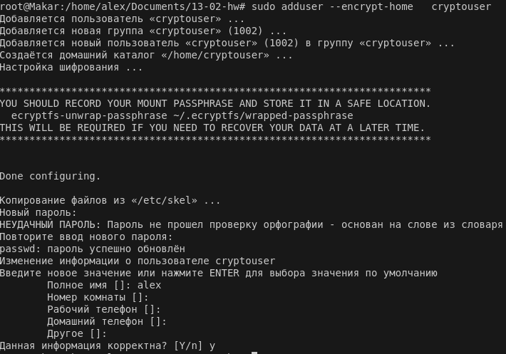
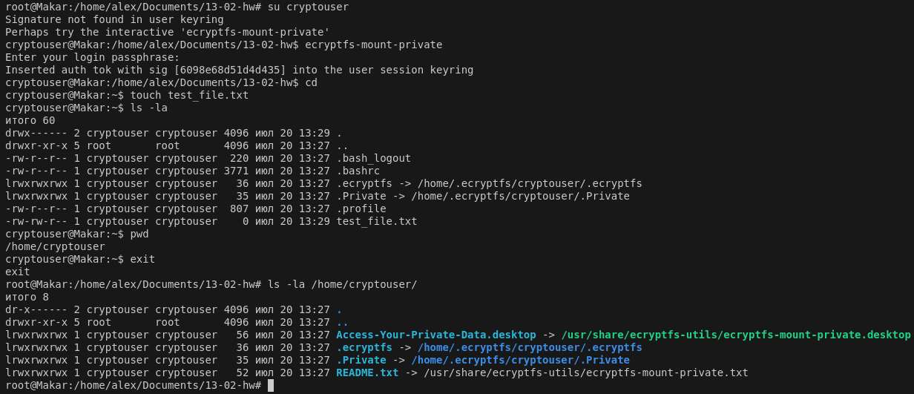
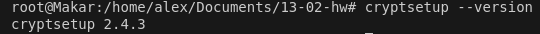
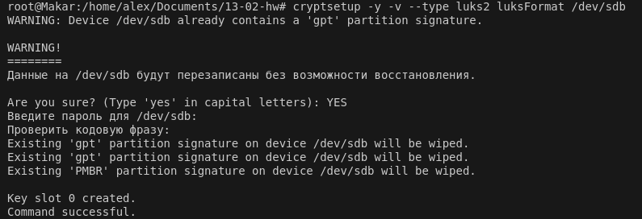
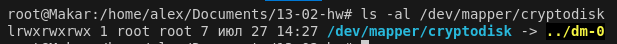
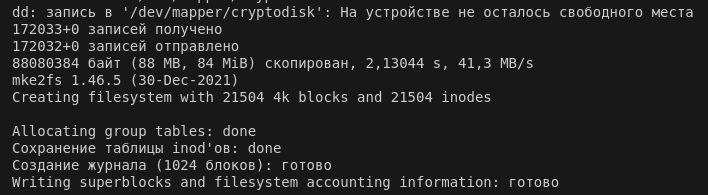

# Домашнее задание к занятию  «Защита хоста» "Макарцев Александр Владимирович"

### Задание 1

1. Установите **eCryptfs**.
2. Добавьте пользователя cryptouser.
3. Зашифруйте домашний каталог пользователя с помощью eCryptfs.


*В качестве ответа  пришлите снимки экрана домашнего каталога пользователя с исходными и зашифрованными данными.*

#### Решение
Установка eCryptfs
```
sudo apt install ecryptfs-utils
```

Создание пользователя cryptouser
```
sudo adduser --encrypt-home   cryptouser
```





### Задание 2

1. Установите поддержку **LUKS**.
2. Создайте небольшой раздел, например, 100 Мб.
3. Зашифруйте созданный раздел с помощью LUKS.

*В качестве ответа пришлите снимки экрана с поэтапным выполнением задания.*

#### Решение
Устанавливаем gparted cryptsetup (LUKS)
```
apt install gparted cryptsetup
```


Добавляем через Virtual Box диск на 100 MiB

Подготавливаем раздел (тип luks2)
```
sudo cryptsetup -y -v --type luks2 luksFormat /dev/sdb
```



Открываем устройство /dev/sdb и задаем ему имя cryptodisk
```
sudo cryptsetup luksOpen /dev/sdb cryptodisk
```



Форматируем раздел
```
sudo dd if=/dev/zero of=/dev/mapper/cryptodisk
```

```
sudo mkfs.ext4 /dev/mapper/cryptodisk
```



Монтируем открытый раздел
```
mkdir .secret
```

```
sudo mount /dev/mapper/cryptodisk .secret/
```

Завершение работы
```
sudo umount .secret
```

```
sudo cryptsetup luksClose cryptodisk
```

## Дополнительные задания (со звёздочкой*)

Эти задания дополнительные, то есть не обязательные к выполнению, и никак не повлияют на получение вами зачёта по этому домашнему заданию. Вы можете их выполнить, если хотите глубже шире разобраться в материале

### Задание 3 *

1. Установите **apparmor**.
2. Повторите эксперимент, указанный в лекции.
3. Отключите (удалите) apparmor.


*В качестве ответа пришлите снимки экрана с поэтапным выполнением задания.*


ecryptfs-unwrap-passphrase
Passphrase:
``` 
9359732699a6164aeb3b82bd1802127c
```